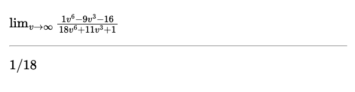
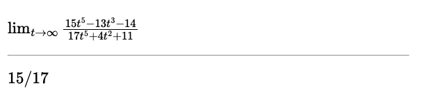
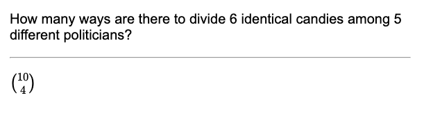
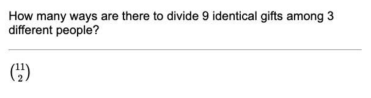
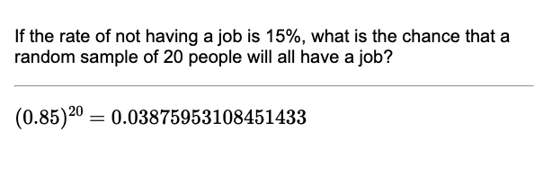
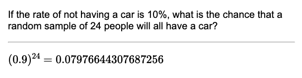

<!-- TODO 2023-12-17 implement "dependent" choices. E.g., if x=job, then y=employment -->
<!-- TODO 2023-12-17 allow spaces in replacement fields -->

This Anki note type attempts to make math practice cards more diverse/interesting by randomizing specified. Ideally this should force your mind to remember the essential points, rather than unimportant details like what the variable names are.

For example, suppose we want to remember the following simple technique to evaluate the limit at infinity of a rational function: just divide both the numerator and denominator by the highest power of the function argument in the denominator. For example:



But of course, the particular variable name, coefficients, exponents, etc. are not important. In fact, we want to remember that the technique applies no matter what they are. If we use this note type to randomize these elements, then the next time we see this card, it might look instead like this:



For more examples, see the bottom of this readme.

# Installing the card

1. Find the path to your Anki media collection, then run `ANKI_MEDIA_PATH={path_to_anki_media_collection} bash copy_to_anki.sh` in the local directory of this repository.
2. Create a new note type called something like "Math substitution card" in Anki with exactly the following three fields: "Front", "Back", "Vars".
3. In the card editor for the new note type, copy the contents of `note/math_card1_front.html` into the front template and the contents of `note/math_card1_back.html` into the back template.

# Layout of the card

The card has three fields:

1. **Front**: Defines the front of the card.
2. **Back**: Defines the back of the card.
3. **Vars**: Defines the symbols that will have substitutions performed and the values or range of values they admit.

To avoid Anki entering `<br>` and `<p>` and other HTML markup in the fields, they should be edited in plain-text editing mode (press cmd-shift-X [on a Mac] after clicking on a field, or click the `<>` to the upper right of the field).

# **Vars** Syntax

The **Vars** field should be a new-line separated list of symbols and substitution values separated by an `=` sign:
- to the left of the `=`, there should be one or more comma separated symbols (e.g., `x`, `x,y,z`, `amount,quantity`). If there is more than one symbol, their values will be sampled from the substitution values without replacement.
- to the right of the `=`, there can be one or more comma-separated values. These can be
    - single values, like `x` or `17`.
    - ranges. These are separated by `:`, thus we can have ranges like `13:17`, which means all the integer values from 13 to 17 (inclusive), or `x:z`, which means all the characters from x to z (thus, {x, y, z}). In the case of integer ranges, there is an optional `step` parameter that can follow a `;`, thus `13:17;2` means {13, 15, 17}. Note that the first item of the range must always be less than the second item, in the case of both numbers and letters (thus both `17:13` and `z:a` are invalid).

Thus, the contents of **Vars** could be something like:

```
x=4:10;2
a,b=x:z
z=7,12,p
```

# **Front** and **Back** Syntax

You can enclose text in `\$` and `$\` within the **Front** and **Back** fields to use MathJax with [Latex style syntax](https://math.meta.stackexchange.com/questions/5020/mathjax-basic-tutorial-and-quick-reference). (I haven't been able to get Latex rendering to work.) (Also, note that these are not the usual delimiters `\(` and `\)`. That's because Anki will replace `\(...\)` with `<anki-mathjax>...<anki-mathjax/>` and this seems to cause all kinds of rendering issues.)

There are two types of replacement field. They can contain:
- **symbols**: the syntax is `SYM[id]`, where `id` is some string (you're probably best off sticking to alphabetic characters). For example, `SYM[x]` or `SYM[myValue]`.
    
    Symbols are replaced by the substitution values specified in **Vars**. Therefore, if **Vars** has the line `x=1,2,3`, and your front or back fields have the string `\sqrt(SYM[x] + z)` `SYM[x]` will be replaced by one of the numbers in 1, 2, or 3, resulting in a string like `sqrt(1 + z)`.

    Note that the substitution value for each symbol will be chosen once per day and will be consistent everywhere on the card that symbol occurs throughout that day. Thus if you have `SYM[x]` on both the front and back of your card, it will have the same value in both cases, and that value will remain the same every time you study that card that day---as long as you don't change the front of the card. (The front of the card is used in the hash that seeds the random number generation, so if you do change it, then you will get a different result.)

    (Note that the `SYM` field is probably redundant since `EXP` (defined below) with a single argument has the same effect.)

- **expressions**: the syntax is `EXP[expression]`, where `expression` is some expression to be evaluated. Importantly, the expression can contain symbols (as long as they are defined as numbers in **Vars**). For example, `EXP[x + y]`. If `x` has the value 1 and `y` has the value 3, then this expression will evaluate to 1 + 3 = 4. Thus, if a card contained `The answer is EXP[x + y]`, this would be replaced by `The answer is 4`.

    Your expressions are evaluated as Javascript. **Warning this means it could be possible for a malicious actor to do some damage to your computer if you studied their cards, so you should only study cards from a source you trust, in particular, those you make yourself.** Thus the usual math operators defined in javascript are all allowed, like + and -. One extra symbol I have defined is the factorial operator `!`, which is defined on nonnegative integers up to 18.

The **Front** and **Back** will both be formatted with markdown.

# Examples


## First example

Front:

```
How many ways are there to divide SYM[m] identical SYM[objects] among SYM[n] different SYM[recipients]?  
```

Back:
```
\$ { EXP[m + n - 1] \choose EXP[n - 1] } $\
```

Vars:
```
m=3:10
n=2:7
objects=candies,gifts,votes,dollars
recipients=people,students,politicians
```

Result:




## Second example

Front:

```
If the rate of not having a SYM[thing] is SYM[x]%, what is the chance that a random sample of SYM[N] people will all have a SYM[thing]?
```

Back:
```
\$ (EXP[1 - (x / 100)])^{SYM[N]} = EXP[(1 - x / 100)**N] $\
```

Vars:
```
x=5:35;5
N=12:32;4
thing=job,car,diploma
```

Result:



